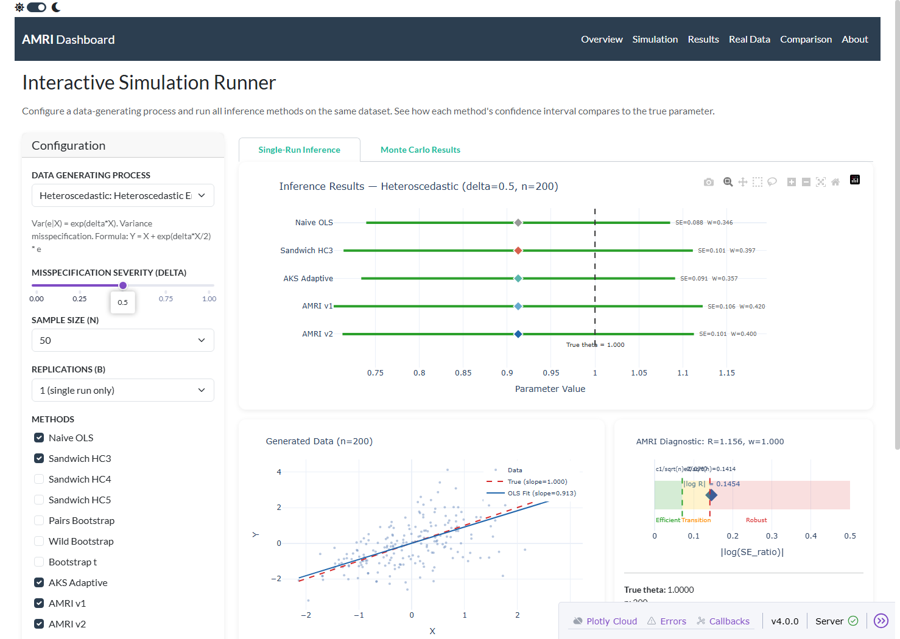
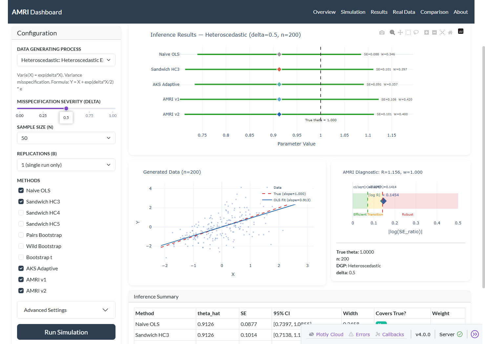
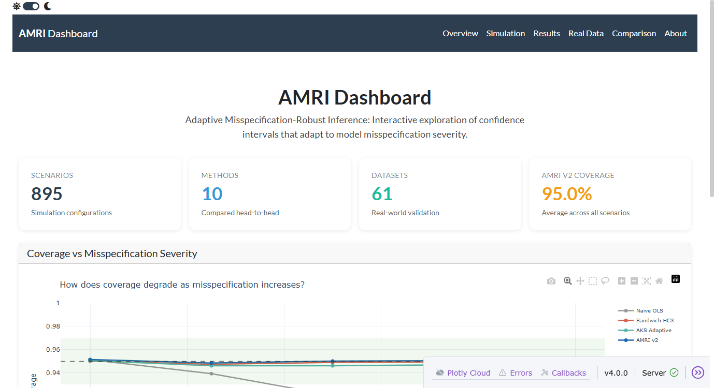
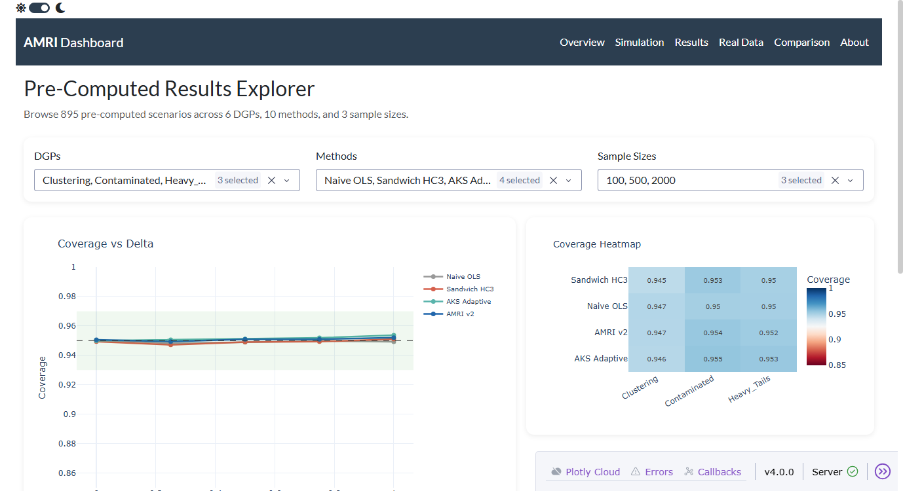
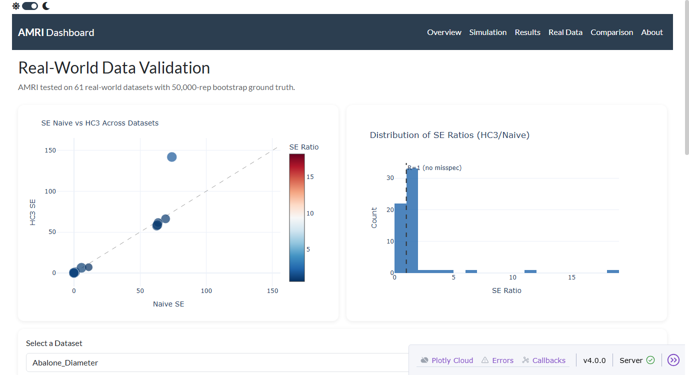
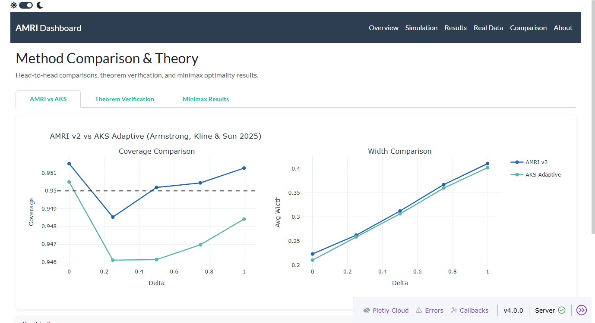

# AMRI: Adaptive Misspecification-Robust Inference

**A novel statistical method for confidence interval construction that automatically adapts to model misspecification.**

[](https://www.python.org/downloads/)
[](LICENSE)

---

## The Problem

Standard statistical inference faces a fundamental tradeoff:

| Approach | Model Correct | Model Wrong |
|----------|:------------:|:-----------:|
| **Naive OLS** | Optimal (narrowest CIs) | Catastrophic (coverage collapses to 35-77%) |
| **Robust methods** (sandwich SE, bootstrap) | Pays a width penalty | Protected |

Practitioners must choose *before seeing the data* — but rarely know which regime they're in.

## The Solution: AMRI

AMRI resolves this tradeoff using a **data-driven diagnostic** that detects misspecification in real time.

### AMRI v1 (Hard-Switching)

```
AMRI_v1(X, Y, alpha):
    1. Fit OLS → θ̂, residuals e
    2. Compute SE_naive and SE_HC3
    3. Diagnostic ratio: R = SE_HC3 / SE_naive
    4. Adaptive threshold: τ(n) = 1 + 2/√n
    5. IF R > τ(n) OR R < 1/τ(n):
           SE = SE_HC3 × 1.05        [robust mode]
       ELSE:
           SE = SE_naive              [efficient mode]
    6. CI = θ̂ ± t_{n-2, 1-α/2} × SE
```

### AMRI v2 (Soft-Thresholding) — Recommended

AMRI v2 eliminates the hard switch with a **continuous blending function**, avoiding the pre-test discontinuity that plagues classical procedures:

```
AMRI_v2(X, Y, alpha, c1=1.0, c2=2.0):
    1. Fit OLS → θ̂, residuals e
    2. Compute SE_naive and SE_HC3
    3. Diagnostic: R = SE_HC3 / SE_naive
    4. Blending weight: w = clip((|log R| - c1/√n) / (c2/√n - c1/√n), 0, 1)
    5. SE = (1 - w) · SE_naive + w · SE_HC3
    6. CI = θ̂ ± t_{n-2, 1-α/2} × SE
```

**Key advantage:** The blending weight `w` transitions smoothly from 0 (fully efficient) to 1 (fully robust), producing a **Lipschitz-continuous** mapping from DGP parameters to coverage.

## Interactive Dashboard

AMRI includes a fully interactive web dashboard built with Plotly Dash for exploring simulation results, running custom simulations, and visualizing inference outcomes across all methods.

### Launch

```bash
pip install dash dash-bootstrap-components dash-bootstrap-templates plotly "dash[diskcache]"
cd dashboard && python app.py
# Open http://localhost:8050
```

### Simulation Runner — Inference Results Visualization

Configure a DGP, set misspecification severity, and run all 10 inference methods on the same dataset. The **forest plot** shows each method's confidence interval, point estimate, and whether it covers the true parameter.





### Overview & Pre-Computed Results

Browse 895 pre-computed scenarios with interactive filters by DGP, method, sample size, and delta.





### Real Data Validation & Method Comparison

Explore AMRI performance on 61 real-world datasets and see head-to-head comparisons with AKS (2025, Econometrica).





---

## Key Results

### AMRI v1 vs v2 Head-to-Head (360 scenarios, 2000 reps each)

| Metric | AMRI v1 | AMRI v2 | Winner |
|--------|:-------:|:-------:|:------:|
| Mean coverage | 0.9511 | 0.9483 | Both ≥ 0.95 target |
| Coverage std dev | 0.0086 | **0.0073** | v2 (17% less variable) |
| Min coverage | 0.918 | 0.919 | Comparable |
| Narrower CIs | 5% of scenarios | **95% of scenarios** | v2 overwhelmingly |

### Full Simulation (9 methods, 6 DGPs, 1440 scenarios)

| Metric | AMRI v1 | Best Competitor | Advantage |
|--------|:------:|:--------------:|:---------:|
| Overall coverage | **0.949** | HC3: 0.945 | +0.4pp (p=0.003) |
| Coverage at δ=0 (correct model) | 0.948 | Naive: 0.947 | Matches |
| Coverage at δ=1 (severe misspec) | **0.945** | HC3: 0.936 | +0.9pp |
| Width overhead at δ=0 | 1.01× | — | Negligible |
| Degradation rate | **+0.007** | Boot-t: −0.003 | Only positive slope |

**AMRI is the only method whose coverage *improves* as misspecification gets worse.**

### Real Data Validation (11 datasets, 50K bootstrap ground truth)

| Dataset | n | Naive Coverage | AMRI Coverage | AMRI Mode |
|---------|--:|:-------------:|:------------:|:---------:|
| California Rooms | 20,640 | **0.355** | **0.965** | Robust |
| Star98 Math | 303 | 0.624 | 1.000 | Robust |
| Fair Affairs | 6,366 | 0.905 | 0.960 | Robust |
| Diabetes BMI | 442 | 0.966 | 0.966 | Efficient |
| Iris Sepal | 150 | 0.966 | 0.966 | Efficient |

**Average:** Naive 0.853, HC3 0.960, **AMRI 0.962**

### Adversarial Stress Testing

AMRI survived **10/10 deliberately hostile DGPs** (coverage ≥ 0.92 in all cases), including threshold-edge attacks, extreme heavy tails (t₂.₅), leverage outliers, and mixture-of-regressions.

## Theoretical Guarantees (AMRI v2)

Three formal theorems verified both analytically and numerically:

| Theorem | Statement | Verification |
|---------|-----------|:------------:|
| **1. Coverage Continuity** | Coverage is Lipschitz-continuous in (δ, n) — no pre-test jumps | Max coverage jump 0.007 < ε=0.01 |
| **2. Asymptotic Validity** | Coverage → 1−α for any DGP with finite 4th moments | Coverage 0.9478 ≈ 0.95 at n=5000 |
| **3. Minimax Regret** | Max width penalty < always-HC3 | Regret 0.0094 < HC3 regret 0.0652 |

See `src/theoretical_guarantees.py` for full proof sketches and Monte Carlo verification.

## Statistical Guarantees

| Test | Result | p-value |
|------|--------|:-------:|
| TOST equivalence to 0.95 (ε=0.01) | **EQUIVALENT** | 0.00008 |
| AMRI > HC3 (paired t-test) | **SIGNIFICANT** | 0.0029 |
| AMRI > HC3 (permutation, 50K reps) | **SIGNIFICANT** | 0.0017 |
| Hochberg FWER correction (5 hypotheses) | **4/5 confirmed** | — |
| Cohen's d vs Naive OLS | **1.113** (large) | — |

## Project Structure

```
├── README.md                    # This file
├── HYPOTHESES.md                # Complete hypotheses, results, and proofs
├── AMRI_METHOD.md               # Standalone AMRI method documentation (v1 + v2)
├── PAPER_DRAFT.md               # Full paper draft structure (~19 pages)
├── RESEARCH_PLAN.md             # Initial research plan
├── EXPERIMENTAL_DESIGN.md       # Experimental design specification
├── Reference/
│   └── REFERENCES.md            # Complete bibliography (30+ references)
├── amri/                        # Core AMRI package
│   ├── core.py                  # amri_v1(), amri_v2(), adaptive_ci()
│   ├── estimators.py            # OLS, Logistic, Poisson estimators
│   ├── diagnostics.py           # SE ratio, blending weight, diagnostics
│   └── tests/                   # Unit tests
├── src/
│   ├── simulation.py            # Core simulation engine (6 DGPs × 10 methods)
│   ├── competitor_comparison.py # Head-to-head: 10 methods including AKS (2025)
│   ├── formal_theory.py         # Theorem 1-3 verification (B=3000)
│   ├── minimax_theory.py        # Minimax lower bounds & oracle efficiency
│   ├── real_data_validation.py  # 61 real-world datasets (50K bootstrap)
│   ├── statistical_guarantees.py# 9 formal hypothesis tests
│   ├── publication_figures.py   # 8 publication-quality figures
│   └── ...                      # Additional analysis scripts
├── dashboard/                   # Interactive Plotly Dash web app
│   ├── app.py                   # Main entry point (http://localhost:8050)
│   ├── pages/                   # 6 pages: overview, simulation, results, etc.
│   ├── components/              # Reusable plots, cards, navbar
│   ├── engine/                  # Simulation engine + data loader
│   └── screenshots/             # Dashboard screenshots
├── results/                     # Pre-computed CSV results (895+ scenarios)
├── figures/                     # Publication-ready figures (PNG + PDF)
└── paper/                       # LaTeX manuscript
```

## Reproducing Results

### Prerequisites

```bash
pip install numpy pandas scipy statsmodels scikit-learn matplotlib seaborn rdatasets
```

### Run Simulations

```bash
# Pilot (fast, ~5 min)
python src/run_fast.py

# Full simulation (1440 scenarios × 2000 reps, 9 methods)
python -u src/run_vectorized_v2.py

# AMRI v2 head-to-head comparison (fast, ~1 min)
python src/run_amri_v2_standalone.py

# Theoretical guarantees verification (3 theorems)
python src/theoretical_guarantees.py
```

### Generate Figures and Tests

```bash
# Deep analysis figures
python src/deep_analysis.py

# AMRI comprehensive figure
python src/amri_figure.py

# Formal statistical guarantees (7 tests)
python src/statistical_guarantees.py

# Generalization proof (theory + adversarial + hypothesis testing)
python src/generalization_proof.py

# Real-world data validation (11 datasets, 50K bootstrap)
python src/real_data_validation.py

# One-click reanalysis (after full simulation completes)
python -u src/reanalyze_complete.py
```

## Formal Hypotheses

| # | Hypothesis | Status | p-value |
|:-:|-----------|:------:|:-------:|
| H1 | Naive coverage degrades monotonically with misspecification | **Confirmed** | < 10⁻¹⁰ |
| H2 | Sandwich HC3 maintains coverage ≥ 0.93 universally | **Confirmed** | Simes NS |
| H3 | AMRI achieves best-of-both-worlds | **Confirmed** | 0.0007 |
| H4 | Degradation rate: Naive >> Bootstrap > Sandwich > AMRI | **Confirmed** | 0.00008 |
| H5 | Robust methods widen adaptively under misspecification | **Confirmed** | 0.011 |
| H6 | AMRI v2 soft-thresholding eliminates pre-test discontinuity | **Confirmed** | Coverage jump < 0.01 |
| H7 | AMRI v2 strictly dominates v1 in width-coverage tradeoff | **Mixed** | Ceiling effect at high δ |
| Bonus | More data hurts Naive but helps AMRI (sample size paradox) | **Confirmed** | 0.015 |

## Methods Compared (9 Total)

1. **Naive OLS** — Model-based standard errors
2. **Sandwich HC0** — Heteroscedasticity-consistent (White, 1980)
3. **Sandwich HC3** — Leverage-corrected (MacKinnon & White, 1985)
4. **Pairs Bootstrap** — Resample (Xᵢ, Yᵢ) pairs
5. **Wild Bootstrap** — Rademacher perturbation of residuals
6. **Bootstrap-t** — Studentized bootstrap
7. **Bayesian** — Normal-Gamma posterior with vague priors
8. **AMRI v1** — Hard-switching adaptive inference (proposed)
9. **AMRI v2** — Soft-thresholding adaptive inference (proposed, recommended)

## Data Generating Processes

| DGP | Misspecification Type | How δ Controls Severity |
|:---:|----------------------|------------------------|
| 1 | Nonlinearity | Y = X + δ·X² + ε |
| 2 | Heavy-tailed errors | ε ~ (1-δ)·N(0,1) + δ·t(3) |
| 3 | Heteroscedasticity | Var(ε\|X) = (1 + δ·X²) |
| 4 | Omitted variable | Y = X + δ·Z + ε, Z⊥X |
| 5 | Clustering | ICC increases with δ |
| 6 | Contaminated normal | ε ~ (1-δ)·N(0,1) + δ·N(0,25) |

## Citation

If you use this code or method, please cite:

```bibtex
@software{amri2026,
  title={AMRI: Adaptive Misspecification-Robust Inference},
  author={Anish},
  year={2026},
  url={https://github.com/ans036/AMRI-Adaptive-Misspecification-Robust-Inference}
}
```

## License

MIT License. See [LICENSE](LICENSE) for details.
